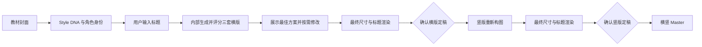
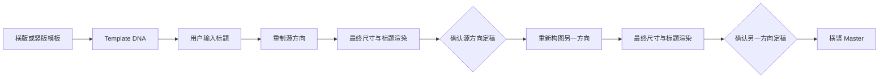

# Certificate Template Studio

[English](README.en.md) · [安装](#安装) · [许可证](#许可证)

一个面向 Codex 的证书与奖状设计工作流 Skill。

它既可以从教材封面提炼 Style DNA、锁定人物与动物角色特征并探索证书方向，也可以将现成横版或竖版证书模板高保真重制为横竖双 Master。v1.7 默认采用质量托管：内部比较三套横版，自动提交最佳合格方案，每个方向最多自动修正一次；同时通过阶段上下文、来源哈希缓存和双 Master 换标题减少重复分析、用户干预与上下文消耗。

## 核心能力

- **双工作模式**：教材封面创作，或现成证书模板双向重制。
- **角色身份锁**：允许姿势和绘制媒介变化，保持脸部、发型、服装、配件及物种特征。
- **质量托管三方向**：教材模式内部评估三种真正不同的横版方向，其中包含完整边框方案；默认只展示最佳合格结果。
- **横竖重新构图**：目标方向不是旋转、拉伸、裁切或机械扩边。
- **固定小程序尺寸**：横版强制输出 `2172 × 1536 px`，竖版强制输出 `1536 × 2172 px`，统一为 PNG。
- **六类标题设计**：正式双层、现代双层、典礼弧形、双层飘带、儿童逐字配色和插画融合底座；底层使用纯色矢量、确定性效果或经过验证的 AI 融合渲染。
- **长标题语义排版**：`CERTIFICATE OF COMPLETION` 强制使用两行，或浅弧/双飘带的等价层级，不压缩成拥挤单行。
- **定稿硬校验**：最终尺寸、比例、标题居中、文件哈希和标题验证写入报告；报告未通过不能批准 Master。
- **单次自动修正**：每个方向最多自动修正一次；仍未达标时暂停说明，不无限重试。
- **明确审批**：只有用户明确确认定稿，状态才会进入下一阶段。
- **非破坏性修订**：LEVEL1/2/3 修改、历史记录与回退。
- **双 Master 复用**：同一教材或模板更换标题时，默认同时复用已经批准的横竖版，不重新探索三套。
- **缓存与最小上下文**：按来源、控制图、角色证据和标题哈希失效，只加载当前阶段所需资料。
- **结构化项目数据**：Style DNA、Template DNA、manifest、revision log 与 JSON Schema。

## 工作模式

每次开始新工作时，Skill 固定显示：

```text
请选择工作模式：
1｜教材封面生成证书
2｜现成模板双向转换

请回复 1 或 2。
```

### 1｜教材封面生成证书



### 2｜现成模板双向转换



## 安装

### 方法一：Git 克隆

macOS / Linux：

```bash
git clone https://github.com/liuxiaoliu2019/certificate-template-studio.git \
  ~/.codex/skills/certificate-template-studio
```

Windows PowerShell：

```powershell
git clone https://github.com/liuxiaoliu2019/certificate-template-studio.git `
  "$env:USERPROFILE\.codex\skills\certificate-template-studio"
```

### 方法二：安装脚本

克隆或下载项目后，在仓库根目录运行：

```powershell
.\install.ps1
```

或：

```bash
./install.sh
```

如果目标目录已经存在，安装器会停止。显式使用 `-Force` 或 `--force` 时，安装器会先把旧目录移动为带时间戳的备份，再执行全新安装。

### 方法三：GitHub Release

从 [Releases](https://github.com/liuxiaoliu2019/certificate-template-studio/releases) 下载最新的版本压缩包，解压到用户的 `.codex/skills/certificate-template-studio` 目录。

安装后建议重启 Codex 或新建任务。

## 使用

在 Codex 中输入：

```text
使用 $certificate-template-studio 开始工作。
```

然后回复 `1` 或 `2`，再上传对应的教材封面或现成证书模板。

正常情况下只在以下节点需要你介入：选择工作模式、补充缺失标题、明确确认横版、明确确认竖版；自动修正一次后仍未通过质量门时才会额外暂停。若要看内部其余合格候选，可直接说“查看其他方案”。

已有 v1.6 或更早项目可先迁移，脚本会在项目内备份旧 manifest，并把缺少新版验证证据的旧 Master 标记为待复核：

```bash
python scripts/migrate_project.py <项目目录>
```

## 运行要求

- Codex 桌面端或其他支持本地 Skills 的 Codex 环境。
- Python 3.10 或更高版本。
- Pillow：读取图片尺寸与方向、角色裁切、最终尺寸处理和确定性标题渲染。
- 能够接收参考图并生成图片的宿主能力。若当前环境没有图像生成能力，Skill 仍可完成分析、配置和 prompts，但不会伪称图片已生成。

开发与验证依赖可通过以下命令安装：

```bash
python -m pip install -r requirements-dev.txt
```

## 目录

- `SKILL.md`：入口、模式路由和不可违反的工作流规则。
- `assets/controls/`：横竖版隐藏控制图。
- `references/`：设计、标题、身份锁、审批、修改和评分规则。
- `prompts/`：各阶段可按需加载的提示词。
- `schemas/`：项目配置和状态记录的 JSON Schema。
- `scripts/`：初始化、最终图片处理、状态更新、修订记录、回退和验证工具。
- `examples/`：不含真实教材或成品图片的虚构文本/JSON 示例。

## 验证

```bash
python scripts/quick_validate.py .
python scripts/public_release_validate.py .
```

第二个命令是一键发布校验：覆盖示例 Schema、控制图与字体哈希、两种模式、固定输出尺寸、六类标题规则、状态与批准门、完整测试、确定性 ZIP 打包、隔离安装和公开安全规则。

## 许可证

- 代码、Prompt、Schema 和文档采用 [MIT License](LICENSE)，版权所有 © 刘小刘。
- `assets/controls/landscape_v3.png` 与 `assets/controls/portrait_v3.png` 采用 [CC BY 4.0](LICENSE-ASSETS.md)，作者为刘小刘。
- 使用控制图时必须保留适当署名。完整说明见 [NOTICE.md](NOTICE.md)。

## 版权边界

本仓库不包含教材封面、出版社 Logo、现成奖状参考图或生成成品。示例教材和项目名称均为虚构内容。使用者应确保自己有权上传和处理输入图片，并自行审查生成结果。

本项目不隶属于、不代表、也未获任何教材出版社、考试机构或证书机构背书。

## 贡献与安全

欢迎通过 Issue 或 Pull Request 提交改进。提交前请阅读 [CONTRIBUTING.md](CONTRIBUTING.md)。安全问题请按 [SECURITY.md](SECURITY.md) 私下报告，不要在公开 Issue 中披露敏感信息。
