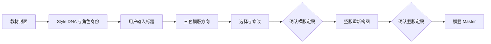
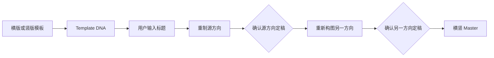

# Certificate Template Studio

[English](README.en.md) · [安装](#安装) · [许可证](#许可证)

一个面向 Codex 的证书与奖状设计工作流 Skill。

它既可以从教材封面提炼 Style DNA、锁定人物与动物角色特征并探索三种证书设计方向，也可以将现成横版或竖版证书模板高保真重制为横竖双 Master。项目内置模式菜单、隐藏布局控制图、标题规则、三级修改、审批锁、版本回退和多标题复用，让证书生成从一次性生图变成可管理、可确认、可持续复用的设计流程。

## 核心能力

- **双工作模式**：教材封面创作，或现成证书模板双向重制。
- **角色身份锁**：允许姿势和绘制媒介变化，保持脸部、发型、服装、配件及物种特征。
- **三方向探索**：教材模式自动提出三种真正不同的横版方向，其中包含完整边框方案。
- **横竖重新构图**：目标方向不是旋转、拉伸、裁切或机械扩边。
- **明确审批**：只有用户明确确认定稿，状态才会进入下一阶段。
- **非破坏性修订**：LEVEL1/2/3 修改、历史记录与回退。
- **双 Master 复用**：同一教材或模板更换标题时，默认复用已经批准的横竖版。
- **结构化项目数据**：Style DNA、Template DNA、manifest、revision log 与 JSON Schema。

## 工作模式

每次开始新工作时，Skill 固定显示：

```text
请选择工作模式：
1｜教材封面生成证书
2｜现成模板双向转换

请回复 1 或 2。
```

### 1｜教材封面生成证书



### 2｜现成模板双向转换



## 安装

### 方法一：Git 克隆

macOS / Linux：

```bash
git clone https://github.com/liuxiaoliu2019/certificate-template-studio.git \
  ~/.codex/skills/certificate-template-studio
```

Windows PowerShell：

```powershell
git clone https://github.com/liuxiaoliu2019/certificate-template-studio.git `
  "$env:USERPROFILE\.codex\skills\certificate-template-studio"
```

### 方法二：安装脚本

克隆或下载项目后，在仓库根目录运行：

```powershell
.\install.ps1
```

或：

```bash
./install.sh
```

如果目标目录已经存在，安装器会停止。显式使用 `-Force` 或 `--force` 时，安装器会先把旧目录移动为带时间戳的备份，再执行全新安装。

### 方法三：GitHub Release

从 [Releases](https://github.com/liuxiaoliu2019/certificate-template-studio/releases) 下载 `certificate-template-studio-v1.5.1.zip`，解压到用户的 `.codex/skills/certificate-template-studio` 目录。

安装后建议重启 Codex 或新建任务。

## 使用

在 Codex 中输入：

```text
使用 $certificate-template-studio 开始工作。
```

然后回复 `1` 或 `2`，再上传对应的教材封面或现成证书模板。

## 运行要求

- Codex 桌面端或其他支持本地 Skills 的 Codex 环境。
- Python 3.10 或更高版本。
- Pillow：项目初始化时读取图片尺寸、方向和角色裁切。
- 能够接收参考图并生成图片的宿主能力。若当前环境没有图像生成能力，Skill 仍可完成分析、配置和 prompts，但不会伪称图片已生成。

开发与验证依赖可通过以下命令安装：

```bash
python -m pip install -r requirements-dev.txt
```

## 目录

- `SKILL.md`：入口、模式路由和不可违反的工作流规则。
- `assets/controls/`：横竖版隐藏控制图。
- `references/`：设计、标题、身份锁、审批、修改和评分规则。
- `prompts/`：各阶段可按需加载的提示词。
- `schemas/`：项目配置和状态记录的 JSON Schema。
- `scripts/`：初始化、状态更新、修订记录、回退和验证工具。
- `examples/`：不含真实教材或成品图片的虚构文本/JSON 示例。

## 验证

```bash
python scripts/quick_validate.py .
python scripts/public_release_validate.py .
```

第二个命令还会检查示例 Schema、控制图哈希、方向识别、公开安全规则和禁止文件。

## 许可证

- 代码、Prompt、Schema 和文档采用 [MIT License](LICENSE)，版权所有 © 刘小刘。
- `assets/controls/landscape_v3.png` 与 `assets/controls/portrait_v3.png` 采用 [CC BY 4.0](LICENSE-ASSETS.md)，作者为刘小刘。
- 使用控制图时必须保留适当署名。完整说明见 [NOTICE.md](NOTICE.md)。

## 版权边界

本仓库不包含教材封面、出版社 Logo、现成奖状参考图或生成成品。示例教材和项目名称均为虚构内容。使用者应确保自己有权上传和处理输入图片，并自行审查生成结果。

本项目不隶属于、不代表、也未获任何教材出版社、考试机构或证书机构背书。

## 贡献与安全

欢迎通过 Issue 或 Pull Request 提交改进。提交前请阅读 [CONTRIBUTING.md](CONTRIBUTING.md)。安全问题请按 [SECURITY.md](SECURITY.md) 私下报告，不要在公开 Issue 中披露敏感信息。
